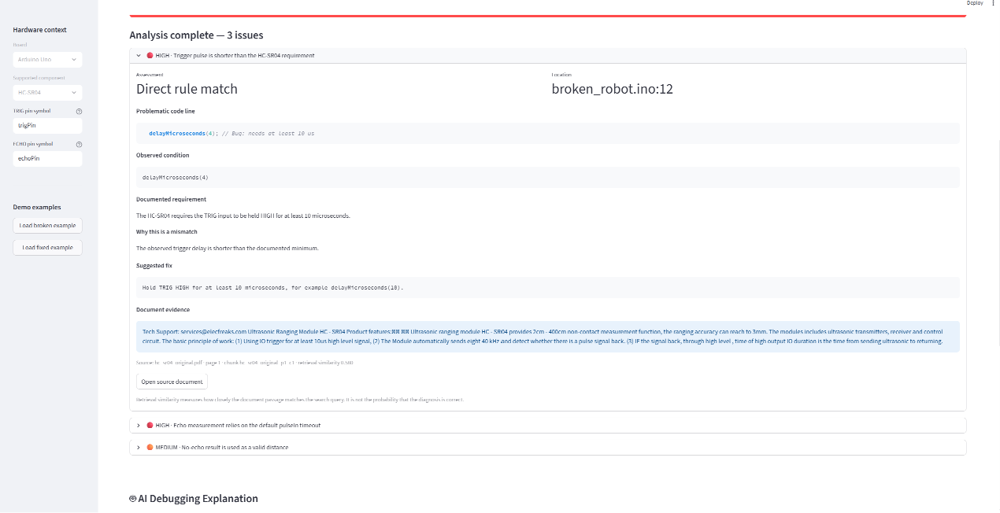

# 🩺 CircuitMedic

**Evidence-grounded debugging for Arduino firmware and embedded hardware.**

CircuitMedic is a debugging assistant for embedded projects. Instead of only reporting suspicious code patterns, it connects firmware findings with technical documentation and explains why a problem may affect the observed hardware behavior.

The current MVP focuses specifically on **Arduino Uno + HC-SR04 ultrasonic sensor firmware**.

> CircuitMedic is currently a focused prototype. It does not claim to analyze every C/C++ or embedded project.

---

## The Problem

Embedded bugs are often difficult to diagnose because the failure can sit between software and hardware.

For example, an obstacle-avoidance robot may occasionally miss objects because:

- the ultrasonic trigger pulse is too short,
- echo measurement relies on an unsuitable timeout,
- a missing echo is treated as a valid distance,
- or sensor timing does not follow the component documentation.

Finding these problems normally requires comparing firmware with datasheets and API documentation manually.

CircuitMedic brings those steps into one debugging workflow:

**Firmware → deterministic checks → documentation retrieval → evidence-backed diagnosis → optional AI explanation**

---

## Current Scope

The current MVP supports:

- **Board:** Arduino Uno
- **Component:** HC-SR04 ultrasonic distance sensor
- **Firmware formats:** `.ino`, `.cpp`, `.h`
- Configurable TRIG and ECHO symbol names
- HC-SR04 trigger timing checks
- `pulseIn()` timeout checks
- no-echo handling checks
- comment-aware analysis
- basic control-flow-aware handling of supported no-echo guards

The analyzer intentionally has a narrow scope so that findings can be explained and grounded in technical evidence.

---

## What CircuitMedic Does

### 1. Deterministic Firmware Analysis

CircuitMedic performs deterministic checks for supported HC-SR04 failure patterns.

Current checks include:

- trigger pulses shorter than the documented requirement,
- `pulseIn()` calls without an explicit timeout,
- supported cases where a no-echo result may be used without being handled.

The analyzer also avoids several known false positives, including unrelated LED `HIGH` operations and code inside comments.

For supported no-echo patterns, CircuitMedic distinguishes between merely checking a value and actually preventing an invalid zero-duration result from being used in a distance calculation.

Trigger timing analysis also handles supported single-line sequences and multiple constant delays between the TRIG `HIGH` and `LOW` operations.

---

### 2. Real Datasheet Ingestion

CircuitMedic includes an ingestion pipeline for a real HC-SR04 datasheet PDF.

The PDF is:

1. read page by page,
2. converted to text,
3. split into smaller chunks,
4. assigned metadata including:
   - document name,
   - page number,
   - unique chunk ID.

This allows a diagnosis to point back to the actual document passage that supports it.

Example evidence metadata:

```text
Source: hc_sr04_original.pdf
Page: 1
Chunk: hc_sr04_original_p1_c1
```

---

### 3. Embedding-Based Documentation Retrieval

CircuitMedic uses local semantic retrieval to connect analyzer findings with relevant technical documentation.

PDF and reference chunks are converted into embeddings. Document embeddings are cached locally so they do not need to be regenerated for every analysis.

The SentenceTransformer model instance is also reused within the running Python process instead of being repeatedly initialized for each retriever.

When the analyzer detects an issue, CircuitMedic searches for documentation relevant to that specific finding.

The retrieval layer includes a relevance threshold so an unrelated query is not automatically presented as evidence.

CircuitMedic deliberately separates different evidence sources:

- the HC-SR04 datasheet supports sensor-specific requirements such as trigger timing,
- the Arduino `pulseIn()` reference supports API-specific behavior such as timeout and zero-return semantics.

This prevents API behavior from being incorrectly attributed to the sensor datasheet.

---

### 4. Evidence-Grounded Diagnoses

Each supported finding is presented as a traceable chain:

```text
Observed code
      ↓
Documented requirement
      ↓
Mismatch
      ↓
Suggested fix
```

Where relevant evidence is available, CircuitMedic also displays:

- source document,
- page number,
- chunk ID,
- retrieved passage,
- retrieval similarity.

Retrieval similarity represents semantic similarity between the search query and documentation passage. It is **not** presented as the probability that a diagnosis is correct.

Findings instead use interpretable assessment labels such as:

- **Direct rule match**
- **Possible issue**
- **Manual review required**

If sufficiently relevant evidence cannot be retrieved, CircuitMedic does not force an unrelated passage to become evidence.

---

### 5. Optional Evidence-Grounded AI Explanation

CircuitMedic can optionally use an OpenAI model to explain the deterministic findings in the context of the user's reported symptom.

The AI layer receives:

- observed symptom,
- board and component context,
- firmware,
- analyzer findings,
- code locations,
- retrieved evidence,
- evidence IDs.

The structured AI response contains:

- possible cause,
- relationship to the symptom,
- technical explanation,
- recommended fix,
- evidence IDs used,
- uncertainty or additional checks.

The AI layer is **not responsible for inventing new analyzer findings**.

CircuitMedic validates evidence IDs returned by the model against the evidence actually supplied to it. If an AI response cites an unknown evidence ID, the explanation is rejected rather than silently removing the invalid citation while keeping potentially unsupported generated text.

The deterministic diagnostic report remains independent from the AI layer. If the API is unavailable, times out, or the AI explanation fails validation, the evidence-backed analyzer report remains available.

AI explanation generation is also skipped when the deterministic analyzer produces no findings.

---

## Demo Workflow

CircuitMedic includes two firmware examples:

```text
data/sample_projects/obstacle_robot/
├── broken_robot.ino
└── fixed_robot.ino
```

### Broken example

Click:

**Load broken example → Analyze firmware**

The application demonstrates supported HC-SR04 problems and shows their corresponding code locations and documentation evidence.

### Fixed example

Click:

**Load fixed example → Analyze firmware**

The corrected example uses the supported fixes, allowing the user to compare the before/after behavior of the analyzer.

You can also:

- upload firmware,
- edit firmware directly in the browser,
- re-upload a modified file with the same filename,
- switch between uploaded firmware and built-in examples,
- re-run the analysis after changing the code,
- optionally generate an AI explanation,
- download the structured report as JSON.

The analyzed report is kept together with the input snapshot that produced it, preventing an old diagnosis from being presented as though it belonged to newly edited code.

The core demo is:

**Detect → retrieve evidence → understand → fix → re-analyze**

---

## Installation

### 1. Clone the repository

```bash
git clone https://github.com/41iclalsevdeyavuz-crypto/CircuitMedic.git
cd CircuitMedic
```

### 2. Create a virtual environment

Windows PowerShell:

```powershell
python -m venv .venv
.\.venv\Scripts\Activate.ps1
```

macOS/Linux:

```bash
python3 -m venv .venv
source .venv/bin/activate
```

### 3. Install dependencies

```bash
pip install -r requirements.txt
```

The embedding model may be downloaded the first time the retrieval system is initialized.

---

## OpenAI API Configuration

An OpenAI API key is **optional**.

The deterministic analyzer, documentation retrieval, and evidence-backed findings can operate without the AI explanation layer.

To enable AI explanations, create a `.env` file in the repository root:

```env
OPENAI_API_KEY=your_api_key_here
OPENAI_MODEL=your_model_name
```

Set `OPENAI_MODEL` to a model available to your OpenAI API account.

An example configuration is provided in:

```text
.env.example
```

Do not commit your real `.env` file or API key.

The API client uses a bounded timeout and limited retry behavior. If AI explanation generation fails, CircuitMedic preserves the deterministic diagnostic report.

---

## Run CircuitMedic

With the virtual environment activated:

```bash
python -m streamlit run app/main.py
```

Then open the local Streamlit address displayed in the terminal.

---

## Run Tests

```bash
python -m pytest -q
```

The automated test suite covers important MVP scenarios including:

- detection of supported issues in the broken HC-SR04 robot example,
- removal of supported findings in the corrected example,
- unrelated LED-only firmware without false HC-SR04 findings,
- commented-out firmware being ignored,
- valid and invalid no-echo handling patterns,
- no-echo checks that do not actually stop invalid data flow,
- single-line HC-SR04 trigger timing cases,
- multiple constant trigger delays,
- rejection of irrelevant documentation queries,
- retrieval of HC-SR04 trigger documentation,
- use of the Arduino `pulseIn()` reference for no-echo behavior,
- rejection of AI explanations containing unknown evidence IDs.

The Streamlit demo workflow is also manually checked before release, including:

- switching between uploaded firmware and built-in broken/fixed examples,
- re-uploading a file with the same filename but different contents,
- editing firmware and re-running analysis,
- preserving the analyzed report and its input snapshot across Streamlit reruns,
- downloading the JSON report for the displayed analysis,
- keeping the deterministic diagnostic report available when AI explanation generation is unavailable.

Passing tests validate the currently supported CircuitMedic checks. They do **not** imply that arbitrary firmware or hardware is completely safe or defect-free.

---

## Report Export

After analysis, the structured diagnostic report can be downloaded as JSON.

The report contains:

- detected issues,
- code locations,
- assessment information,
- documentation evidence and metadata,
- retrieved evidence IDs,
- and the AI explanation when one was successfully generated and validated.

---

## Architecture

```text
Arduino Firmware
       │
       ▼
Deterministic HC-SR04 Analyzer
       │
       ├── Trigger timing rules
       ├── pulseIn() timeout checks
       └── No-echo handling checks
       │
       ▼
Evidence Query
       │
       ▼
Embedding-Based Local Retriever
       │
       ├── HC-SR04 Datasheet PDF Chunks
       └── Arduino pulseIn() Reference
       │
       ▼
Evidence-Grounded Diagnostic Report
       │
       ├── Observed code
       ├── Requirement
       ├── Mismatch
       ├── Suggested fix
       └── Source / page / chunk
       │
       ├──────────────────────┐
       │                      │
       ▼                      ▼
Base Report            Optional LLM Explanation
                              │
                              ▼
                     Evidence-ID Validation
                              │
                              ▼
                     Validated AI Explanation
       │
       └──────────────┬───────┘
                      ▼
              Streamlit UI
                      │
                      ▼
                 JSON Report
```

The AI layer augments the deterministic report rather than replacing it.

---

## Known Limitations

CircuitMedic is currently an MVP with deliberately limited hardware and language understanding.

Current limitations include:

- Only HC-SR04-specific checks are implemented.
- Arduino Uno is the currently supported board context.
- The analyzer does not perform complete C++ parsing or full program analysis.
- Complex or dynamic control flow may require manual review.
- Trigger timing analysis is designed for supported constant-delay patterns rather than arbitrary timing expressions.
- Pin roles are supplied through TRIG/ECHO symbol names rather than inferred from arbitrary firmware.
- The tool does not verify electrical wiring or physical hardware faults.
- Retrieval is limited to the documentation included in the project.
- AI explanations depend on external API availability.
- A valid evidence ID does not by itself prove that every generated sentence is supported by the cited passage.
- AI explanations should not override deterministic evidence.
- A report with no findings means **no issue was found within the currently supported checks**; it does not guarantee that the firmware or hardware is completely correct or safe.

---

## Demo & Screenshots

### Application Screenshot



### Demo Video

🎥 **CircuitMedic — AI Copilot for Embedded Hardware & Firmware Debugging | AI Builders Hackathon 2026**

Watch the full 3:46 demo:

[https://youtu.be/69w5OnE2sR0](https://youtu.be/69w5OnE2sR0 )

The demo shows the complete CircuitMedic workflow:

**Detect → Retrieve Evidence → Explain → Fix → Re-analyze**

It includes evidence-grounded diagnosis, AI-assisted explanation, recommended fixes, uncertainty checks, and the **3 → 2 → 0 findings** validation workflow.

## Project Structure

```text
CircuitMedic/
├── app/
│   ├── analyzers/
│   │   └── hc_sr04.py
│   ├── rag/
│   │   ├── ingest.py
│   │   └── retriever.py
│   ├── services/
│   │   ├── diagnostic_engine.py
│   │   └── llm_service.py
│   ├── main.py
│   └── models.py
│
├── data/
│   ├── datasheets/
│   └── sample_projects/
│       └── obstacle_robot/
│           ├── broken_robot.ino
│           └── fixed_robot.ino
│
├── docs/
│   └── images/
│       └── circuitmedic-demo.png
│
├── tests/
│   ├── test_diagnostic_engine.py
│   ├── test_edge_cases.py
│   ├── test_llm_service.py
│   └── test_retriever.py
│
├── .env.example
├── requirements.txt
└── README.md
```

---

## Why CircuitMedic?

CircuitMedic's goal is not to replace an embedded engineer or claim that an LLM can automatically debug arbitrary hardware.

The goal is narrower:

> **Turn embedded debugging findings into traceable explanations backed by the code and the documentation engineers actually use.**

For the current MVP, that workflow is demonstrated end-to-end with Arduino Uno and HC-SR04 firmware.

Future versions can extend the same architecture to additional sensors, boards, motor drivers, and more advanced firmware analysis without changing the core principle:

**deterministic detection first, technical evidence second, AI explanation last.**
